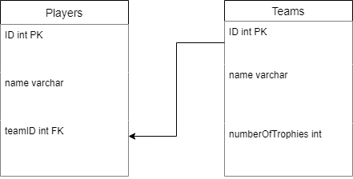
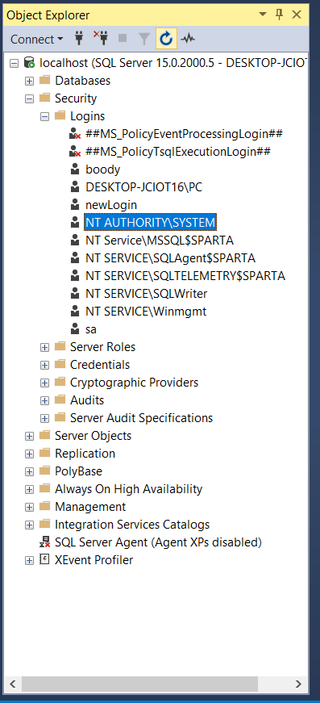
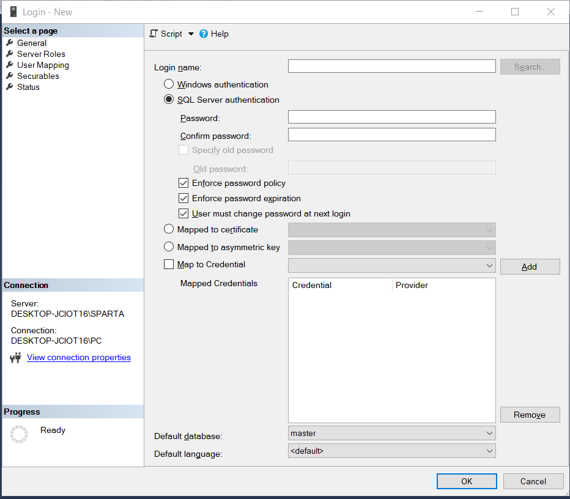
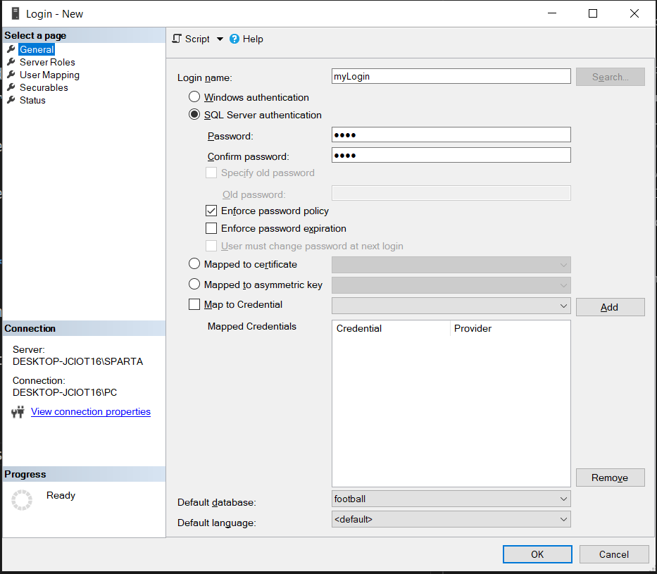
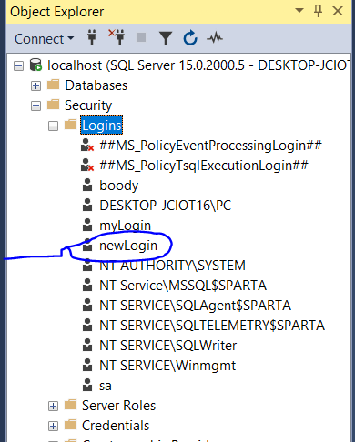
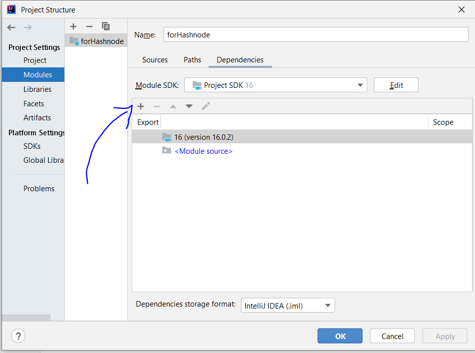
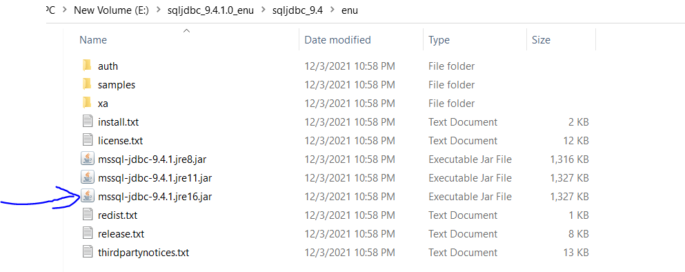

## Steps
1. prepare the environment
   1. let reader know what you are using
      1. for java
      2. for sql
   2. setup the project
2. download the jar file
   1. provide link to the official site
   2. clarify what to do next
3. add the jar file to the project structure
4. go to SSMS
   1. introduction to logins
   2. create new login
   3. clarify everything 
   4. set name and password
   5. IMPORTANT NOTES
5. go to the intellij
   1. import jar file
   2. make connection
   3. run query
   4. reseve data
6. DONE


# Start Building Database Java Applications with SQL Server

welcome to my first article on hashnode, in this article you will learn almost everything to start using database in your future Java Applications.

in this article I will use 
* **intellij idea** for Java *you can use your favorate IDE*
* **SSMS** for SQL Server 


## When To Use Database?

first you should know when to use Database in your programs:

1. if you have multi user application
2. if you need to store Data about users for later use like name, birthday, account, password .... etc.

## Let's Start
as example for using database I am using database that i created is called **football** contains 2 Tables connected as shown:




### Connect Sql Server Database to Java Code

to connect database with java code with SQL Server you should have **Login**.

#### What is Login?
simply it is a user that has some permitions to connect to database and make changes to it.

SQL Server already has a lot of Logins used by the Server itself, you can find them as shown below



### Let's Create Our Own Login

1. left click on Logins Folder
2. choose Create New Login
3. this window will show up 
4. fill the Name I will call it **myLogin** *you can name it whatever you want*.

5. choose a password and confirm it I will choose **pass** *you can choose whatever you want*.

6. > **Note** uncheck 'enforce password expiration'

7. you can change the defualt database to your spacific database *optional*.

8. on left side go to **Server Roles** *this is simply detects what you can do by this user* by defualt it is public, you can check them all, I will do this.

9. on the left side Go to **User Mapping** *this simply checkes which databases this user has access to*, i will Check them all.
    
10. leave everything else as default 
11. click ok ✔

congratulations!! let's see our new Login Now in Logins, if you don't see it just refresh the object explorer.



our Login now is Ready to go, let's prepare our code

### Java Code

to connect database with java code we need a **JDBC** to handle this for us.

#### What is JDBC?
it is abbreviation for **Java Data Base Connector** for sql server download it from the official Microsoft site or form [Here](https://docs.microsoft.com/en-us/sql/connect/jdbc/download-microsoft-jdbc-driver-for-sql-server?view=sql-server-ver15).


this will download a zip file, follow along:
1. extaract the File 
2. > **Note** remember where did you save the extracted Folder
3. open Intellij and create a normal java project
   1. Go To File on the left top 
   2. click on **Project Structure**
   3. this window will appere 
   4. click the plus Button and choose **Jar Directories**
   5. choose this file from the place where you extracted the zip file 
4. click Apply and ok

## It's Time To Code 👨🏼‍💻 

read this code **everything is explaned in comments**

```java

import java.sql.*;

public class Main {
    public static void main(String[] args) throws SQLException {
        // url is a string connection with server
        // jdbc:sqlserver://localhost;Database=yourDatabaseName
        final String url = "jdbc:sqlserver://localhost;Database=football";

        // our login name -- we created previously
        final String userName = "myLogin";

        // the password for this login
        final String password = "pass";

        // make connection
        Connection connection = DriverManager.getConnection(url, userName, password);
        System.out.println("connected Successfully");

        // statement is an object to run SQL on the connection
        Statement statement = connection.createStatement();

        // the SQL query to be excuted
        String query = "select * from team";

        // resultset is an object to store data returned from the Statement
        ResultSet resultSet = statement.executeQuery(query);

        // now all the result is in resultSet

        // while it is not empty get the next row
        // getstring Function takes index of the column (starts with 1)
        while(resultSet.next()) {
            System.out.println(resultSet.getString(1) + " -> " +
                               resultSet.getString(2) + " -> " +
                               resultSet.getString(3));
        }

        // don't forget to close the connection once you finish working with it
        connection.close();
    }
}


```


## Conclusion

Building a Database application isn't super easy, you need to design your Database very well to avoid Production Catastrophies, now you know how to deal with it, it's all about Practicing.


If you like this article please give it a like and your feedback in comments down below, Thank you for Reading.

